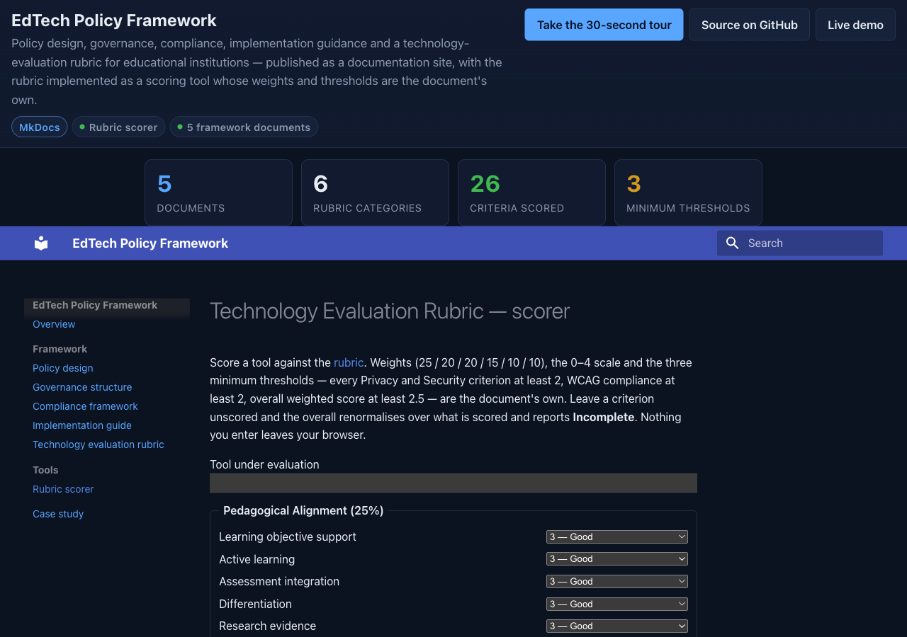

# EdTech-Policy-Framework: a policy framework for educational technology, published as a site, with the evaluation rubric turned into a tool that enforces its own thresholds

[](https://github.com/Freddricklogan/EdTech-Policy-Framework/actions/workflows/deploy.yml)
[](#5-getting-started--verification)
[](https://github.com/Freddricklogan/EdTech-Policy-Framework/actions/workflows/codeql.yml)
[](LICENSE)
[](https://freddricklogan.github.io/EdTech-Policy-Framework/)

## 1. Executive Summary & Business Impact

**Problem statement.** Institutions adopting educational technology
need a policy lifecycle, a governance structure, a compliance map, an
implementation plan and a way to evaluate tools. This repository held
all five as Markdown, readable on GitHub and nowhere else, and its
evaluation rubric — six weighted categories, 26 criteria, three
minimum thresholds — had to be scored by hand. Hand-scored rubrics
miss exactly the rules they exist to enforce: a single 0 that should
disqualify, a privacy line under 2 that should fail.

**What this delivers.** The framework as a navigable site built with
MkDocs and Material, and the rubric as a scoring tool whose arithmetic
is a tested module: weighted average with renormalisation for partial
scoring, the three thresholds from the document, disqualification on
any 0, and a Markdown export a committee can paste into its minutes.
A 26-line spreadsheet becomes 26 selects and one sentence.

**Who it is for.** Instructional-technology committees, CIO and
provost offices setting EdTech policy, and procurement teams that
need a defensible, repeatable evaluation record.

**[→ Read the full case study](docs/CASE_STUDY.md)**

## 2. Demonstrated Competencies & Technical Skills

| Area | What the repository shows |
| --- | --- |
| Policy design | Lifecycle, governance, compliance, implementation and evaluation documents written for K-12 and higher-education decision makers |
| Rubric engineering | A document's scoring rules made executable and pinned by tests: weights, renormalisation, per-line thresholds, disqualification |
| Static publishing | MkDocs + Material, `strict` build so a broken cross-reference fails CI |
| Front-end discipline | ES modules, no inline handlers, no `innerHTML`; pure logic separated from DOM code and tested at 100% statements |
| CI/CD | Lint → tests → strict site build → npm audit + Trivy → Pages deploy; CodeQL on a schedule |

## 3. System Architecture & Data Flow

```
docs/*.md ──────────────┐
docs/tools/rubric.md ───┤  mkdocs build --strict  ──►  site/  ──►  GitHub Pages
docs/assets/            │
  ├─ lib/rubric.js  ◄───┼── tests/rubric.test.js (Vitest, 100% statements)
  ├─ rubric-page.js     │   builds the form, calls evaluate(), renders outcome + Markdown
  ├─ site.js            │   mounts the Executive Shell on every page
  └─ shell/             │   exec-shell.js / .css (vendored)
```

Every page is static. The rubric runs entirely in the browser; nothing
is sent anywhere. No CSP `<meta>` is set because Material relies on
inline scripts; the tool's own code has no inline handlers or styles.

## 4. Technical Highlights & Engineering Decisions

- **The document is the specification.** `CATEGORIES`, `SCALE` and
  `THRESHOLDS` in `docs/assets/lib/rubric.js` are the values from
  `docs/technology-evaluation-rubric.md`; the module adds arithmetic
  and nothing else, so a change to the policy is a change to two
  files that the tests will notice.
- **Partial scoring is honest.** Unscored criteria are `null`, not 0.
  Category averages ignore them, weights are renormalised over scored
  categories, and the outcome stays `Incomplete` until every line has
  a score — so a committee cannot read a "pass" off a half-finished
  form.
- **Thresholds are evaluated on what is scored.** A privacy line of 1
  fails as soon as it is entered, before the form is complete, because
  that is the moment someone can still ask the vendor a question.
- **Material's GitHub widget removed.** `repo_url` makes the theme
  call the GitHub API for release metadata on every page and log a 404
  when there are none; the Executive Shell carries the repository link.
- **Kit reuse.** The site scaffold, workflows and shell are the shared
  MkDocs kit used by the other documentation repositories in this
  portfolio, so the next framework needs only its tool module.

## 5. Getting Started & Verification

**Prerequisites.** Node 22, Python 3.12 and `uv`.

```bash
git clone https://github.com/Freddricklogan/EdTech-Policy-Framework.git
cd EdTech-Policy-Framework
npm ci && uv venv && uv pip install -r requirements.txt
npm run check            # eslint, vitest --coverage, mkdocs build --strict
uv run mkdocs serve      # http://127.0.0.1:8000/EdTech-Policy-Framework/
```

**Verification — the numbers this repository actually produced:**

| Check | Result |
| --- | --- |
| Tests (Vitest) | **6 passed / 6** |
| Coverage | **100%** statements, 94.33% branches over `docs/assets/lib/rubric.js` |
| ESLint | clean |
| `mkdocs build --strict` | 0 warnings, 8 pages |
| Rubric | 6 categories, 26 criteria, weights 25/20/20/15/10/10, thresholds privacy ≥ 2 each, WCAG ≥ 2, overall ≥ 2.5 |
| Site smoke (headless Chrome) | **0 console errors / 0 warnings**; 26 selects; outcome moves Incomplete → threshold failure → "Meets minimum thresholds — proceed to pilot · overall 3.05 / 4.00"; no horizontal scroll at 1280 or 400 px |

## 6. Live Demo & Production Showcase

**<https://freddricklogan.github.io/EdTech-Policy-Framework/>** — the
framework and the rubric tool at **Tools → Technology evaluation
rubric**.

**30-second guided walkthrough.** Press **Take the 30-second tour** in
the header: the framework's five documents, then the rubric page where
scoring a tool produces an outcome and a Markdown record.



**Related.** The other framework repositories in this portfolio use
the same site kit: AI-Ethics-Education-Framework (impact-assessment
worksheet) and Public-Service-Digital-Transformation (maturity
calculator).

---

## License

MIT — see [LICENSE](LICENSE).
